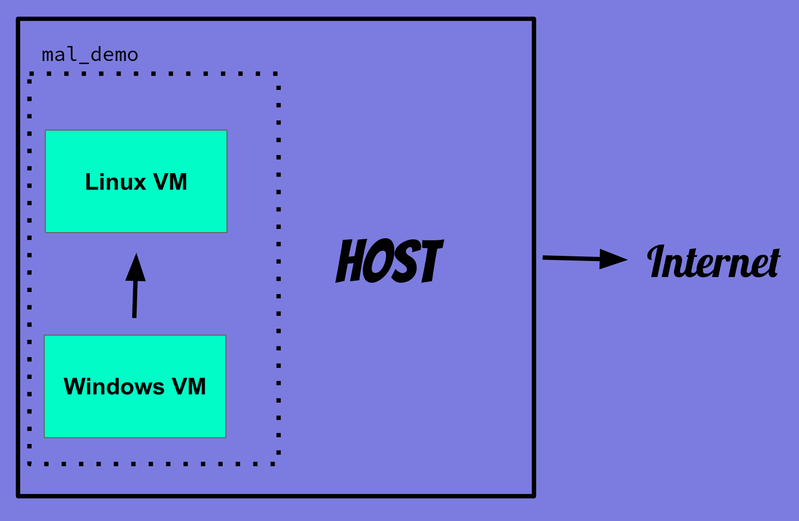
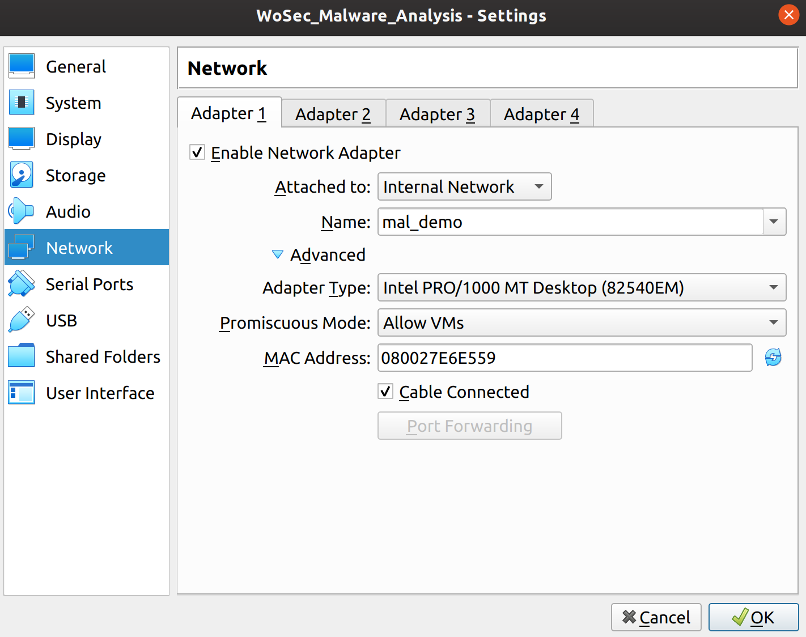
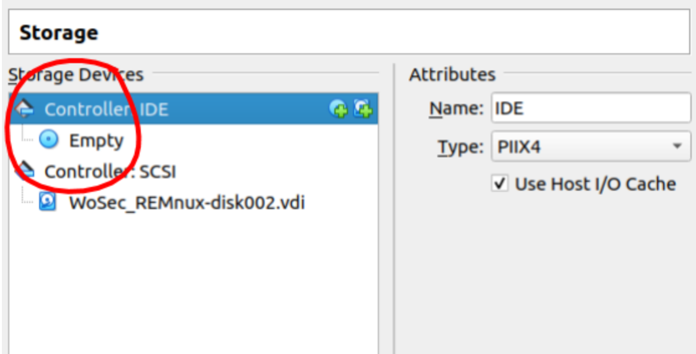
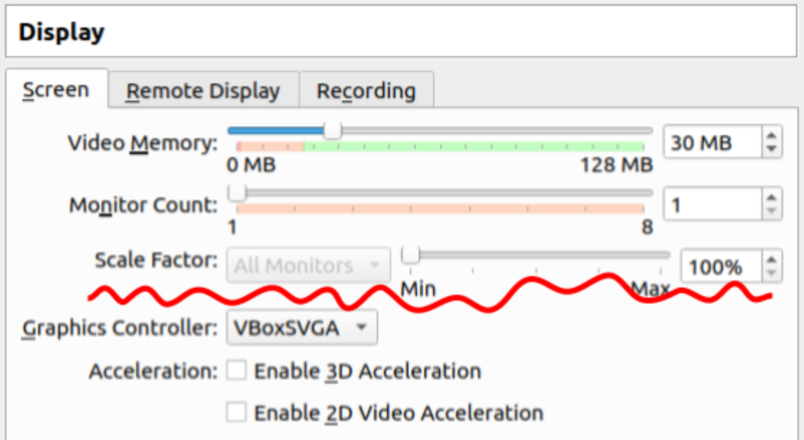
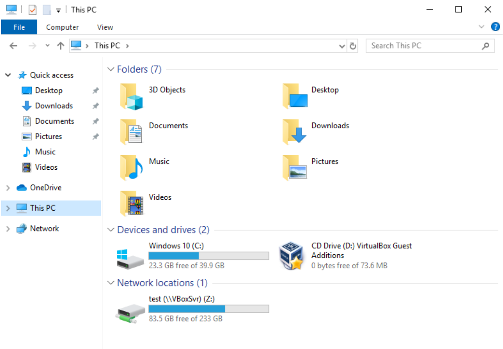

# Workshop Requirements <sup>*** (O_o) ***</sup>

## Skillset

- Awesomeness (｡◕‿◕｡)
- Curiosity (⊙.☉)7
- Patience (╯°□°)╯︵ ┻━┻

## Tools Required:

- Preferably a machine with more than 8 GB of RAM
  - So umm yah...the VMs are huge. More RAM can ensure less latency or avoid a frozen machine (x_X). You can do this.
- [VirtualBox 6.1](https://www.virtualbox.org/wiki/Downloads) <sup>*** (^_^) ***</sup>

## Lab Setup Guide 

In our lab we want all traffic from the Windows VM (where we will be running malware) to pass through the Linux VM (which acts as a fake DNS and sniffer).  
Additionally we not want the VMs to communicate with out Host machine and vice versa (to be safe) and definitely not to communicate with the Internet.

This is what we're aiming for:  


- The VMs are:
  - WoSec_Malware_Analysis.ova [Download Here](https://drive.google.com/open?id=1UFZ3WRpGEnNaF0dMS0m_a5lOUDXYpDv1)
    - ~ 8 GB
    - Windows 10 environment for running malware.
    - password: *infectedmachine*
  - WoSec_REMnux.ova [Download Here](https://drive.google.com/open?id=1I80zKVPWa4J5l8t_cVW1V9URKnTUdgku)
    - ~ 2 GB
    - REMnux Ubuntu distro which contains tools for analyzing malware.
    - List of [tools](https://remnux.org/docs/distro/tools/) that arrive with the distro.
    - Additional tools installed: [Ghidra](https://ghidra-sre.org/), [IDA Free](https://www.hex-rays.com/products/ida/support/download_freeware/)

- Import the VMs to VirtualBox: `File --> Import Appliance`

- Before starting up the VMs, let's change some settings:

  > **Network Settings**
  - Under each VM settings there should be one network adapter and it has been set to `Host-only Adapter`. Initially I had planned for it this way; then realised it is best to not enable the Host and the VMs to communicate with each other. 
  - Let us change that to `Internal Network` for both VMs. Give it a name you like (in the example I used `mal_demo`) and make sure to sue the same name in both VMs. Additionally under `Advanced`, change the `Promiscuous Mode` to `Allow VMs`.
  - Make sure there is no NAT adapter. We do not want these VMs to have access to the interwebs.
  

  > **System Settings**
  - Adjust the Base Memory as you see fit. Otherwise in this configutation WoSec_REMnux is set to ~1GB and WoSec_Malware_Analysis is set to ~4GB. If the VMs are slow, it would mean more RAM is needed as long as it doesn't compromise the performance of your Host machine ;).

  > **Storage Settings**
  - Both VMs would need an optical disk drive for the VirtualBox guest additions iso. This is to enable us to install guest additions to the VMs and we'd be able to adjust display size and copy data between Host and Guest.
  

  > **Display Settings**
  - Since the VMs were created with HDD in mind; it might be a good idea to check these settings. Set the scale factor to 100% if your machine does not have HDD. If it does, you may find increasing the scale is useful especially if after starting the VM you notice the font size is really small.
  

  - **NOTE**: These settings are not exhaustive. You may find you will need to tweak settings according to your environment and taste. Some factors might become apparent after starting your VM :)

- Start your VMs! One at a time, just saying. Install guest additions.
  - For both vms, once started, you'll be able to install the Guest additions from the menu `Devices --> Insert Guest Additions CD image...`. The iso gets stored in the empty optical disk drive we created before.
  - In some cases VirtualBox is known to complain that it is unable to download the guest additions iso (because it has happened to me...urgh). You can find an appropriate iso from here https://download.virtualbox.org/virtualbox/. Choose the one for your version and edit the storage settings for the optical disk drive to point to the path of this iso. 

  > **Windows VM** 
  - If the iso has been mounted, you should see it under the list of drives. Just double click it and execute the prompt that follows. May require a restart.
  

  > **Linux VM**
  - In the linux VM, open a terminal, mount and run the iso with the following commands:
  ```
  sudo mount /dev/sr0 /mnt/cdrom/
  sudo /mnt/cdrom/VBoxLinuxAdditions.run
  ```
     
  
  - Test if the drag/drop feature works. If not create a shared folder. 

- Final step: check if the VMs communicate properly (:-D)
  - On linux run `ifconfig`, the IP should be `192.168.56.101`. On Windows run `ipconfig`, the default gateway should be `192.168.56.101`. So you've probably guessed that all traffic from Windows is routed to the Linux :)
  - Now to simulate a fake internet. On the linux VM, run `inetsim` on one terminal and `fakedns` on another. 
  
  - On Windows, browse to some domain and you should see this!:
  

---

## WOAH YOU MADE IT!

Absolutely don't worry if it is hard to get set up or frustrating.

The idea behind this setup guide, before even the workshop has even begun (OMG x_X), is to make sure we can do more fun stuff... like run malware... during the 3 hours (Yay!). 

And even if most of the time goes to setting up the lab, well then it just goes towards setting up the lab hehe. Personally this is fun. How many people do you know have a malware lab? (っ▀¯▀)つ Building a lab is never normally easy, is part of the process and there is a lot to learn from it as well.

Don't feel shy to get in touch before hand to make sure all works well. I will go over the Lab setup more or less briefly through the workshop.

Apart from that; check out 'em toolzzz in the vms! Have fun!

---

<sup>*** (^_^) *** Any other virtual machine software of your choice can be used. However I suggest VirtualBox 6.1 and above since the VMs were created with that version (6.0 could work as well) and have certain settings that are available on the latest distributions. Additionally much of the setup guide is demonstrated with VirtualBox. The VMs used are OVA packages. Here is a list on [Wiki](https://en.wikipedia.org/wiki/Open_Virtualization_Format) of softwares that support the OVF standard. </sup>

<sup>*** (O_o) *** If at any point this sounds like mumbo jumbo because most probably I am lazy with documentation; DM me on twitter [@sud0suw](https://twitter.com/sud0suw) or email 0xd0cf11e@gmail.com </sup>